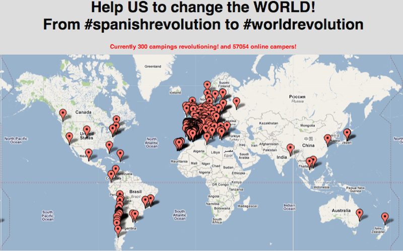

!SLIDE transition=scrollLeft 
# Del Copyleft al #Globalcamp
## 30 años para ver nacer el cerebro red social
-><-
### 16/08/2011
### Mexico

!SLIDE transition=scrollLeft
# Del Copyleft al #Globalcamp

## Hola!
### Daniel Vazquez

!SLIDE smbullets incremental transition=scrollLeft
# Que se juega en el ciberespacio 
## Marga Padilla
* Una buena introducción, podéis colaborar
* [http://www.unalineasobreelmar.net/politizaciones/index.php?title=Politizaciones_en_el_ciberespacio](http://www.unalineasobreelmar.net/politizaciones/index.php?title=Politizaciones_en_el_ciberespacio)

!SLIDE bullets incremental transition=scrollLeft
# Del Copyleft a la cultura y a la calle 1998-2011
* Existe Nodo50, nace Sindominio
* Expertos en tecnología se acercan a centros sociales

!SLIDE smbullets incremental transition=scrollLeft
# Del Copyleft a la cultura y a la calle 1998-2011
* Aparecen las primeras áreas telemáticas: Espacios con software libre
* Nace Hackmeeting / Hacklabs: De lo global a lo local
* Se traspasa todo ese mundo copyleft a la cultura y a la movimientos sociales
* Es donde hay que estar: De esa contaminación nacerán nuestros propios aliados, con estructuras más fuertes.

!SLIDE smbullets incremental transition=scrollLeft
# Del Copyleft a la cultura y a la calle 1998-2011
## Ejemplos
* Traficantes de sueños: Editorial,librería y distribuidora
* Periódico Diagonal

!SLIDE smaller smbullets incremental transition=scrollLeft
# 2002 Copyright y Maremoto (Wu ming)
### Actualmente existe un amplio movimiento de protesta y transformación social en gran parte del planeta. Tiene potencialidades constituyentes desmesuradas, pero aún no es completamente consciente de ello. Aunque su origen es antiguo, se ha manifestado sólo recientemente, apareciendo en varias ocasiones bajo los reflectores mediáticos y, sin embargo, trabajando día a día lejos de ellos. Está formado por multitudes y por singularidades, por retículas capilares en el territorio. Cabalga las más recientes innovaciones tecnológicas. Le quedan pequeñas las definiciones acuñadas por sus adversarios. Pronto será imparable y la represión nada podrá contra él.
* Es lo que el poder económico llama "piratería". 
* Es el movimiento real que suprime el actual estado de las cosas.
* [http://www.sindominio.net/biblioweb-old/telematica/maremoto.html](http://www.sindominio.net/biblioweb-old/telematica/maremoto.html)

!SLIDE smaller smbullets incremental transition=scrollLeft
# La batalla por "#LeySinde"
* Hacktivistas.net: 2008 Filtración de ACTA
* Concreta las prácticas de guerrilla de comunicación anteriores
* Abre la participación al ser un conector con herramientas
* Salir de la oscuridad para ser visibles
* Acciones: Siereslegalcomparte, lalistadesinde, sindegate, etc.
* Miles de personas se suman a estas acciones
* La desobediencia y activismo telemático se asientan como práctica social ante injusticias

!SLIDE smbullets incremental transition=scrollLeft
# La batalla por #LeySinde
* 2008-2011 Las redes sociales son ya un hervidero, decenas de miles usan esos canales para participar como enjambres.
* Wikileaks y Anonymous entran en escena planteando el conflicto a nivel global
* Copiar, descargar, redistribuir pasa a ser algo normal
* Pese a presiones de SGAE y la industria (Juicio Pablo Soto y más)

!SLIDE smbullets incremental transition=scrollLeft
# Múltiples actores
* RedSostenible aparece en los cables de wikileaks: Pocos pero desconocemos su potencial
* EXGAE, abogados, bloggers, periodistas
* Páginas de enlaces
* Nolevotes
* Anonymnous y los Goya

!SLIDE smbullets incremental transition=scrollLeft
# Al final
* SGAE descabezada
* LeySinde muy débil
* Sociedad que ve el proceso entero del "Sindegate" cada vez más indignada y acostumbrada a participar en acciones de rechazo

!SLIDE smaller smbullets incremental transition=scrollLeft
# 15M #Globalcamp, de la red a la calle
* @acampadasol como fenomeno vírico
* Vídeo: [http://15m.bifi.es/](http://15m.bifi.es/)
* 1¼ día se plantea estrategia de comunicación
* Se crean cuentas en redes sociales
* El 1¼ solidario que viene a dormir llega a las 2 horas tras enterarse ¡por twitter!

!SLIDE smbullets incremental transition=scrollLeft

<iframe width="640" height="510" src="http://www.youtube.com/embed/H5w4amBIHj4" frameborder="0" allowfullscreen></iframe>

!SLIDE smbullets incremental transition=scrollLeft
# 15M globalcamp
* Infraestructura en acampadasol con software libre
* Servidores con Debian Gnu/Linux, solo se instala y trabaja con software libre
* Creación de herramientas para cerebro colectivo: Listas, Propongo, Stopdesahucios
* Se promueve el uso de n-1.cc como red social de trabajo

!SLIDE smbullets incremental transition=scrollLeft
# ¿Y cómo pasamos a takethesquare?
* La velocidad del virus anima a pensar en global
* Cientos de plazas tomadas por todo el mundo (imagen)
* Ahí está unos de los primeros virus de la red a la calle a nivel global

!SLIDE smbullets incremental transition=scrollLeft
-><-

!SLIDE smbullets incremental transition=scrollLeft
# ¿Hacia donde vamos?
* Contexto: 2¼ Crisis económica global (o expolio) del siglo XXI
* La viralidad del 15M y la sociedad red en España muestran parte del camino
* Redes de enjambres: Permeables, veloces, hiperconectadas
* De la red a la calle y vuelta a la red
* Herramientas tecnológicas p2p de lobby ciudadano
* Que permitan la organización de la sociedad en enjambres globales
* Capaces no solo de sacudir al sistema financiero sino de sustituirlo 

!SLIDE smbullets incremental transition=scrollLeft
# El futuro ya está aquí
* Actuable, getup, avaaz, oiga.me
* N-1.cc, Diaspora
* Sistemas de banca, kickstarter, Bitcoin
* Transporte compartido, Couchsurfing, reciclaje con nolotiro

!SLIDE 
# Del Copyleft al #Globalcamp
## ¿Preguntas?
-><-
### 16/08/2011
### Mexico

!SLIDE 
# Del Copyleft al #Globalcamp
## Gracias
-><-
### 16/08/2011
### Mexico
