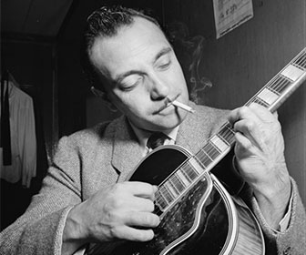

!SLIDE transition=fade

->  <-

!SLIDE transition=fade

# Django: Curiosidad

## Llamado así por Django Reinhardt

->  <-

!SLIDE transition=fade

->  <-

## Framework web <strong>MTV</strong> hecho en Python

!SLIDE transition=fade

# MTV, casi como MVC

## MVC = Model View Controller
## MTV = Model Template View
