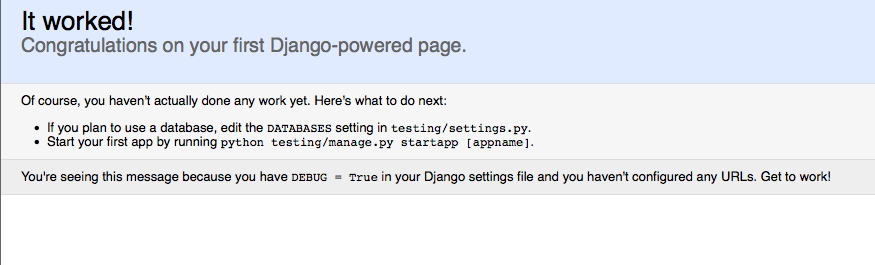

!SLIDE commandline incremental transition=fade

# Primeros pasos

    $ django-admin.py startproject testing
    $ ls testing/
     __init__.py manage.py   settings.py urls.py

!SLIDE commandline incremental transition=fade

# Primeros pasos

    $ cd testing
    $ python manage.py runserver

!SLIDE transition=fade

->  <-

