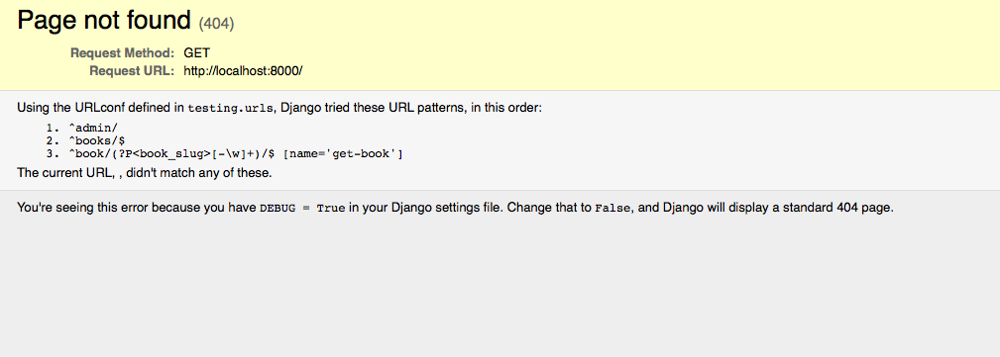

!SLIDE transition=fade

# /

->  <-

!SLIDE transition=fade

# /admin/

->  <-

!SLIDE transition=fade

->  <-

!SLIDE transition=fade

->  <-

!SLIDE transition=fade

->  <-

!SLIDE transition=fade

->  <-

!SLIDE transition=fade

->  <-

!SLIDE transition=fade

# /books/

->  <-

!SLIDE transition=fade

# /book/1984/

->  <-
