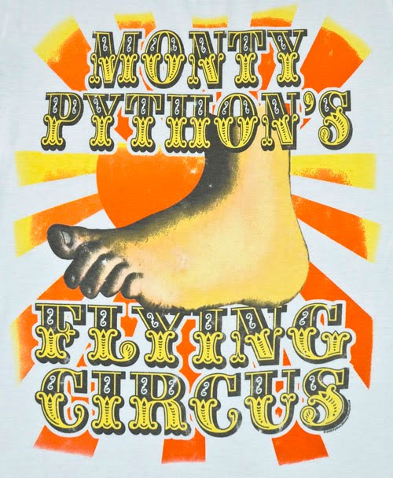

!SLIDE bullets incremental transition=fade

# Python: Curiosidad

* Llamado asi por los Monthy Python ;)

!SLIDE transition=fade

->  <-

!SLIDE bullets incremental transition=fade

# Python: Características

* Sintaxis limpia
* Indentación obligatoria: 4 espacios, nada de llaves 
* Nada de ; al final de cada linea
