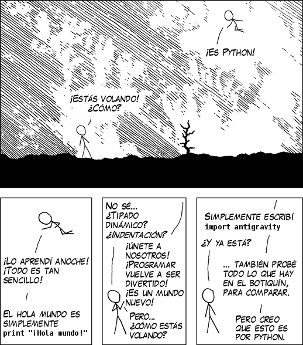

!SLIDE bullets incremental transition=fade

->  <-

# Curiosidad

* Llamado asi por los Monthy Python ;)

!SLIDE transition=fade

->  <-

!SLIDE bullets incremental transition=fade

->  <-

# Características

* Sintaxis limpia
* Indentación obligatoria: 4 espacios, nada de llaves 
* Nada de ; al final de cada linea

!SLIDE transition=fade

->  <-

## Fuente: http://es.xkcd.com/strips/python/
