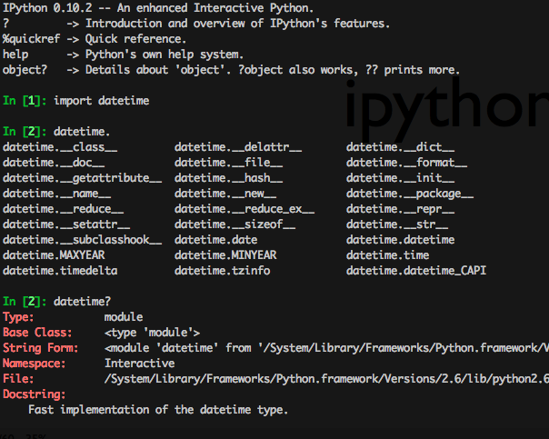

!SLIDE smaller transition=fade

    @@@python
    >>> import this

!SLIDE smbullets smaller transition=fade

# The Zen of Python, by Tim Peters

* Hermoso es mejor que feo.
* Explícito es mejor que implícito.
* Simple es mejor que complejo.
* Complejo es mejor que complicado.
* Plano es mejor que anidado.
* Disperso es mejor que denso.
* La legibilidad cuenta.
* Los casos especiales no son suficientemente especiales como para romper las reglas.
* Aunque lo pragmático gana a la pureza.

!SLIDE smbullets smaller transition=fade

# The Zen of Python, by Tim Peters

* Los errores nunca deberían dejarse pasar silenciosamente.
* A menos que se silencien explícitamente.
* Cuando te enfrentes a la ambigüedad, rechaza la tentación de adivinar.
* Debería haber una — y preferiblemente sólo una — manera obvia de hacerlo.
* Aunque puede que no sea obvia a primera vista a menos que seas holandés. (NT: Guido van Rossum es holandés)
* Ahora es mejor que nunca.
* Aunque muchas veces nunca es mejor que *ahora mismo*.
* Si la implementación es difícil de explicar, es una mala idea.
* Si la implementación es sencilla de explicar, puede que sea una buena idea.
* Los espacios de nombres son una gran idea — ¡tengamos más de esas!

!SLIDE transition=fade

# ipython

->  <-

!SLIDE bullets transition=fade

# Recursos 

* http://es.diveintopython.org/
* http://learnpythonthehardway.org/
* http://www.python.org/doc/

