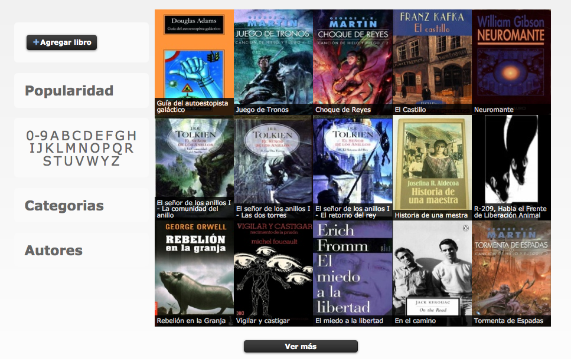

!SLIDE transition=fade
->  <-

## Liberateca es una página de enlaces de nueva generación. Código libre, desarrollo abierto, sin publicidad, sin ánimo de lucro, comunitaria y autogestionada. 

!SLIDE transition=fade

->  <-

!SLIDE transition=fade

->  <-

!SLIDE transition=fade

->  <-

!SLIDE transition=fade

->  <-

!SLIDE transition=fade

->  <-

!SLIDE transition=fade

->  <-

!SLIDE transition=fade

->  <-
