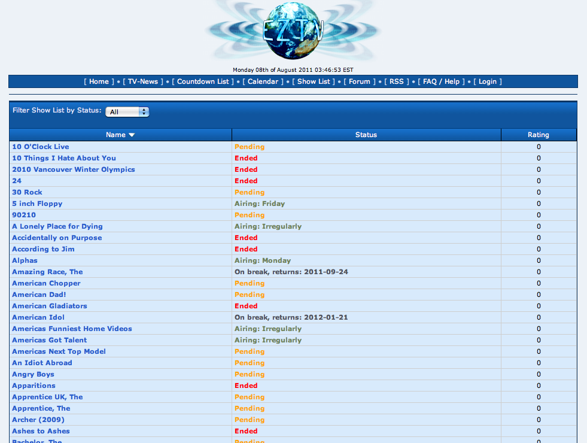

!SLIDE transition=fade

# Precedentes: 

## eztv 
## espoiler.tv

!SLIDE transition=fade

->  <-

!SLIDE transition=fade

->  <-

!SLIDE  transition=fade

# Problema 1
## Sólo de series 

!SLIDE transition=fade

# Problema 2
## No son software libre 
