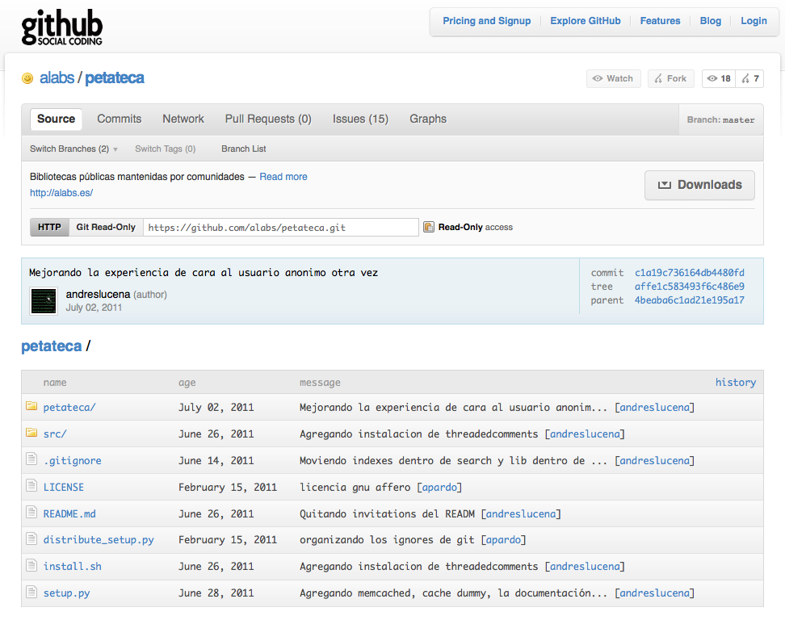
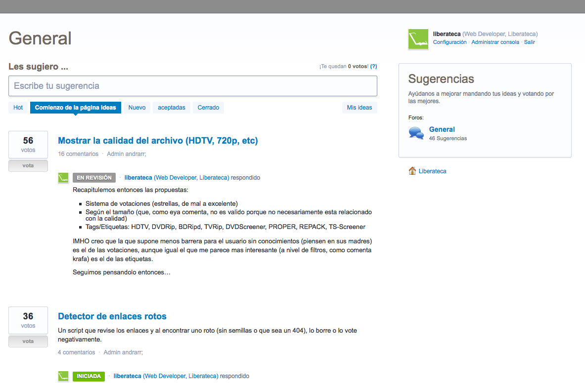
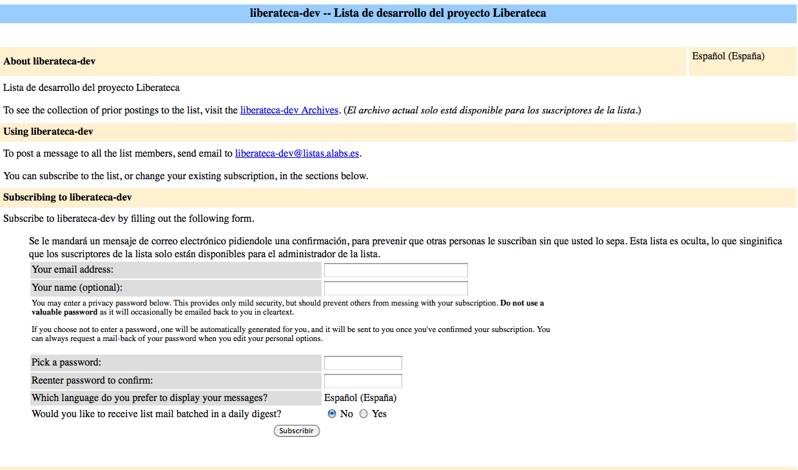
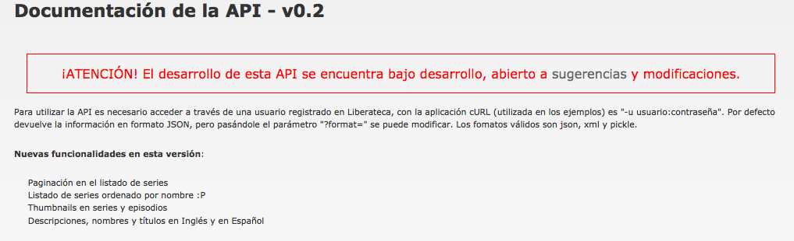

!SLIDE bullets incremental transition=fade

# Liberateca: Características #

* Código libre
* Desarrollo abierto
* Comunitaria y autogestionada
* Sin publicidad ni ánimo de lucro
* API

!SLIDE  transition=fade

# Código libre

## github

!SLIDE  transition=fade

->  <-

!SLIDE transition=fade

# Desarrollo abierto

## UserVoice

!SLIDE  transition=fade

->  <-

!SLIDE transition=fade

# Comunitaria y autogestionada

## Lista de correo

!SLIDE transition=fade

->  <- 

!SLIDE transition=fade

# Sin publicidad ni ánimo de lucro

!SLIDE transition=fade

# API

!SLIDE transition=fade

->  <-

!SLIDE  transition=fade

->  <-

