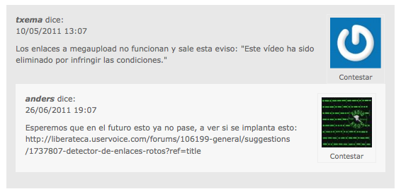

!SLIDE transition=scrollLeft

# django-threadedcommnets

!SLIDE transition=scrollLeft

# Comentarios

## Empezamos usando django.contrib.comments

### [https://docs.djangoproject.com/en/dev/ref/contrib/comments/](https://docs.djangoproject.com/en/dev/ref/contrib/comments/)

!SLIDE transition=scrollLeft

# Comentarios

## django.contrib.comments

-><-

!SLIDE transition=scrollLeft

# django-threadedcomments
## Comentarios anidados. 

### [https://github.com/HonzaKral/django-threadedcomments](https://github.com/HonzaKral/django-threadedcomments)

!SLIDE transition=scrollLeft

# django-threadedcomments

-><-

!SLIDE transition=scrollLeft

# django-threadedcomments

## El futuro 

### El sistema de comentarios ideal es reddit, que permite anidar + markdown + votar por comentarios, ordenando por la cantidad que tenga. 

!SLIDE transition=scrollLeft

# Comentarios

## Reddit

-><-

!SLIDE transition=scrollLeft

# Comentarios

## Reddit

-><-
