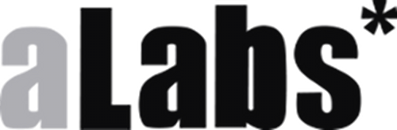

!SLIDE transition=fade
->  <-

-> [http://alabs.es](http://alabs.es) <-

!SLIDE transition=fade

-> aLabs somos una asociación de Madrid, donde ayudamos a proyectos de **software libre** a desarrollarse, a asociaciones e instituciones a usar las **nuevas tecnologías** y a todo tipo de organizaciones a **superar las barreras tecnológicas** y avanzar en la mejora de sus **sistemas**. Creemos que una **sociedad libre, conectada y activa**, es la mejor garantía para un avanzar hacia un **nuevo modelo** necesario. Para ello estamos creando toda una serie de proyectos relacionados con la **democracia participativa** mediante el uso de tecnologías libres, con herramientas para apoyar proyectos libres que permitan **transformar la realidad**. <-
