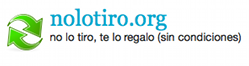
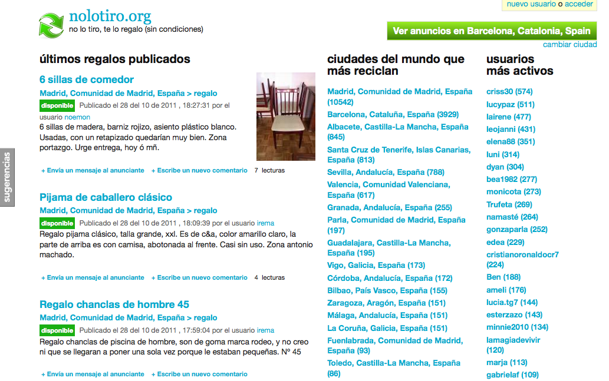
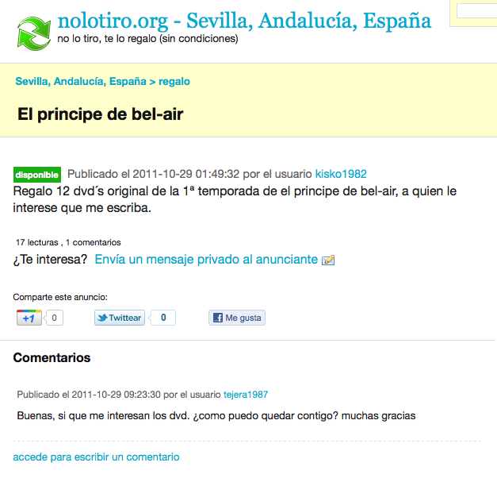

!SLIDE transition=fade
->  <-

-> [http://nolotiro.org/](http://nolotiro.org/) <-

!SLIDE transition=fade

# nolotiro.org

## nolotiro.org es un sitio web donde ofrecer al público, las cosas que ya no quieres o ya no necesitas para que las recoja otra gente a la que puede servirle o serle de mucha utilidad. 

!SLIDE transition=fade

!SLIDE transition=fade

!SLIDE transition=fade

!SLIDE transition=fade

#Código 

GNU Affero GPL v3

[https://github.com/alabs/nolotiro](https://github.com/alabs/nolotiro)
