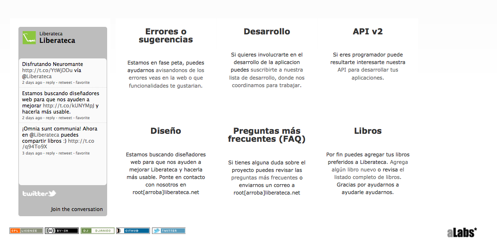
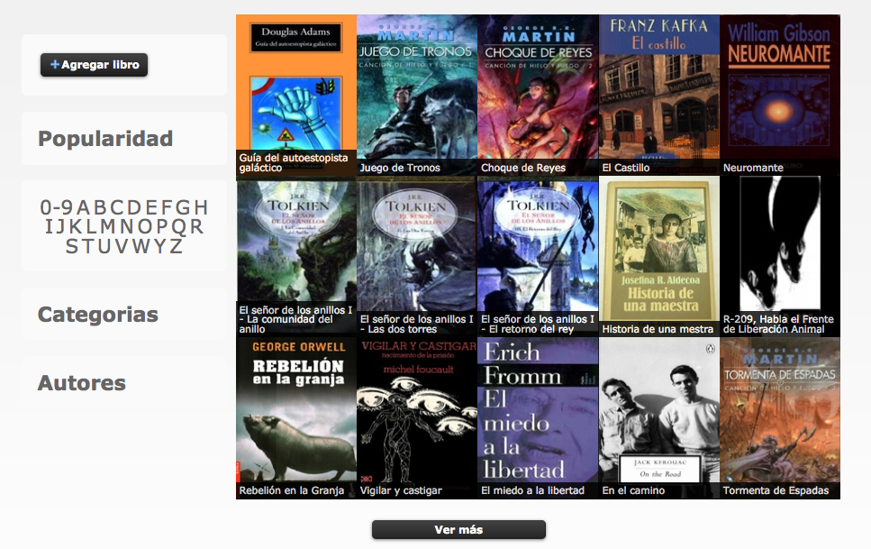
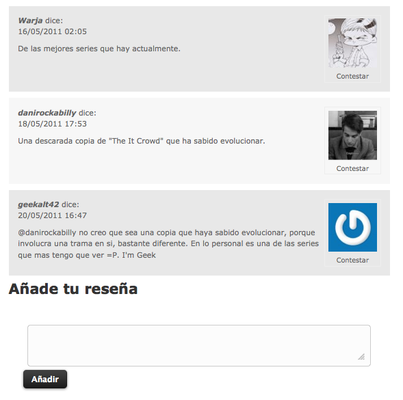
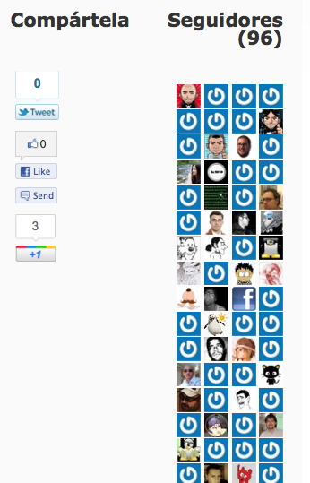

!SLIDE transition=fade
->  <-

[Liberateca](http://liberateca.net/)

!SLIDE transition=fade

# Liberateca

## Liberateca es una página de enlaces de nueva generación. Código libre, desarrollo abierto, sin publicidad, sin ánimo de lucro, comunitaria y autogestionada. 

!SLIDE transition=fade

!SLIDE transition=fade

!SLIDE transition=fade

!SLIDE transition=fade

!SLIDE transition=fade

!SLIDE transition=fade

 

!SLIDE transition=fade

!SLIDE transition=fade

#Código 

GNU Affero GPL v3

[https://github.com/alabs/petateca](https://github.com/alabs/petateca)

