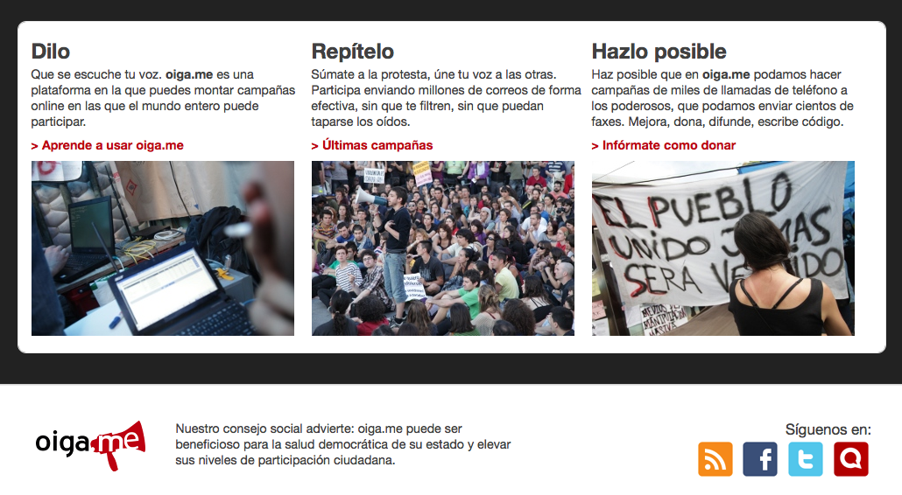
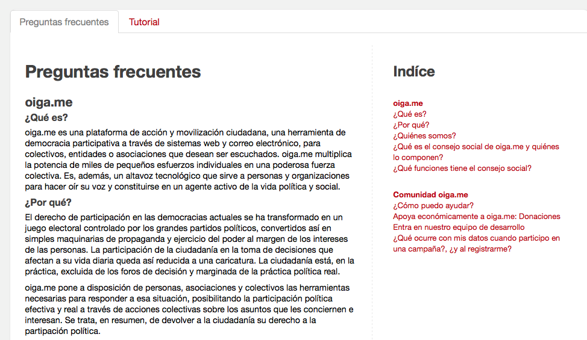
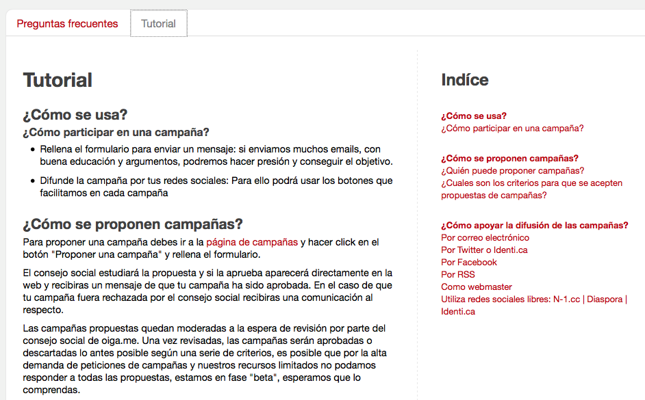
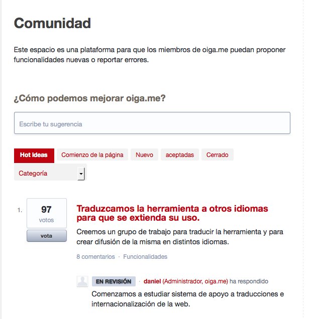

!SLIDE transition=fade

->  <-

[http://oiga.me](http://oiga.me)

!SLIDE transition=fade

# oiga.me

oiga.me es una plataforma de acción y movilización ciudadana, una herramienta de democracia participativa. 

!SLIDE transition=fade

!SLIDE transition=fade

!SLIDE transition=fade

!SLIDE transition=fade

!SLIDE transition=fade

!SLIDE transition=fade

#Código 

GNU Affero GPL v3

[https://github.com/alabs/oigame](https://github.com/alabs/oigame)

